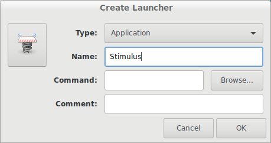
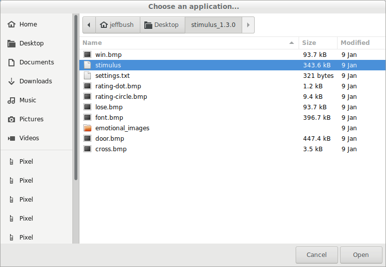

# NOTICE
* The materials covered by the associated license relate to a general purpose product and its underlying designs, schematics, and hardware and software code (collectively “Contributions”), none of which have been evaluated, cleared or approved for any medical or other purpose by and may not meet applicable safety or other legal or regulatory requirements of any governmental agency, including but not limited to the United States Food and Drug Administration (“FDA”), or equivalent regulatory bodies outside of the US.
* Any use of the term “EEG” or “electroencephalogram” contained in the Contribution is for informational purposes only and does not label, represent or otherwise indicate the Contribution is intended to be used or has been reviewed or approved as a medical device by the US FDA or equivalent regulatory bodies outside of the US.
* Any article, material or other publication by any person or entity referencing the use or operation of the Contribution for a medical or other any other purpose is for informational purposes only; does not directly or indirectly represent or infer any intended use in the diagnosis of disease or other conditions, or in the cure, mitigation, treatment, or prevention of disease, in people or animals; and does not label, represent or otherwise indicate the Contribution is intended to be used or has been reviewed or approved as a medical device by the US FDA or equivalent regulatory bodies outside of the US.
* While the Contributions may have potential medical applications, many countries, including the US, require regulatory approvals prior to using any device in the diagnosis of disease or other conditions, or in the cure, mitigation, treatment, or prevention of disease, in people or animals.
* It is the user’s responsibility to secure all necessary regulatory approvals and meeting all applicable government safety and environmental standards associated with use of the Contributions.

# Stimulus

This program is used in our experiments to present interactive tasks to participants.
It will simultaneously send a signal out an attached parallel or serial port to mark
timing of on-screen events. This is designed to have low and consistent timing latency
between the two.

## Build Environment

### Linux (Ubuntu)

- Install packages:

        sudo apt-get install cmake libsdl2-dev g++ libjpeg-dev libboost-all-dev libsdl2-image-dev

- Build

        mkdir build
        cd build
        cmake ..
        make

To access the serial port on Linux, you must add the user to the dialout group:

    sudo usermod -a -G dialout [current user name]

Then reboot the machine.

To prepare a release, compress the files in the build directory:

    emotional_images/...
    cross.bmp
    door.bmp
    dot.bmp
    font.bmp
    lose.bmp
    o.bmp
    win.bmp
    x.bmp
    settings.txt
    stimulus

A machine that this is installed on must also install the following libraries:

    sudo apt-get install libsdl2-2.0 libjpeg62

### OSX

- Install XCode from App Store app.
- Install homebrew from https://brew.sh/  (this will require getting an exception to disable
Santa on gMacs)
- Install tools (note, this does *not* require sudo):

        brew install cmake sdl2 libjpeg boost

Then build similar to linux:

    mkdir build
    cd build
    cmake ..
    make

### Windows

Download SDL development libraries from here:

https://www.libsdl.org/download-2.0.php

On Windows, these are expected to be in the directory: `C:\Users\user\SDL2-2.0.8\`
Unfortunately, Microsoft removed the option to set include/library directories outside
of a project. If these are run on a system with a different username, the project will
need to be updated: Ensure the project is selected in the solution explorer
pane. Right click and select properties. Select the VC++ directories item in the
list on the left and change the 'Include Directories' and 'Library Directories' so
they contain the proper path to the SDL folder.

In order to run, this requires the SDL2.dll to be in the same directory with the
executable. This can be copied from the archive downloaded above: `lib\x86\SDL2.dll`

This also requires the libjpeg library (version 6b), which can be downloaded here:

http://gnuwin32.sourceforge.net/packages/jpeg.htm

Add the path to Release/libjpeg.lib to the project as described above. This needs to be
installed to pick up the libjpeg headers (as this is a static library, no DLL is
required).

Before building, ensure the 'Release' version of the 'x86' project are selected in the
title bar.

To use the parallelport, you will need to download the inpout32 library from
http://www.highrez.co.uk/downloads/inpout32/. Run the installer executable to install
the driver, then copy inpout32.dll to the install folder.

To prepare a release, ZIP the following files in the Release directory:

    emotional_images/...
    cross.bmp
    door.bmp
    font.bmp
    lose.bmp
    win.bmp
    SDL2.dll
    settings.txt
    stimulus.exe

## Usage Instructions

This is a Windows program that will run a number of stimulus tasks, sending timing information out the serial port. You can press `CTRL + C` at any time to exit the application.

### Setup

#### Linux (Ubuntu)

Install necessary libraries. From a terminal:

    `sudo apt-get install --no-install-recommends libjpeg8 libsdl2 gnome-panel`

Extract the folder to the desktop. From the terminal:

    `gnome-desktop-item-edit ~/Desktop/ --create-new`

This will pop up a dialog. Set the name to ‘Stimulus’.

Click the ‘Browse…’ button and navigate in the file launcher to the stimulus executable on the desktop:

#### Windows

Extract the folder to the desktop.

#### All Platforms:

Edit the file 'settings.txt' to configure the program. Each line is a separate key value pair, which are separated by a space. Here are the meaning of the settings:

|||
|--- |--- |
|monitor_width, monitor_height|Dimensions of viewable portion of monitor in centimeters|
|baud_rate|Speed for serial port|
|mark_format|This can be: (1) **brainometer**: each mark is a string of the form: `mark <id> \r\n` sent over the serial port. (2) **byte**: Each mark is sent as a single byte. (3) **parallelport**: Talk to parallel port. Must also specify `mark_parallelportaddress`|
|mark_directory|If this is specified, the program will write a CSV file containing information about marks. The first column is a timestamp, in milliseconds, and the second is the mark identifier.|
|mark_parallelportaddress|If mark_format is parallelport, this is an integer that specifies the ISA port where the hardware is mapped. This is only supported on x86/windows platforms.|
|mark_serialportname|If this is specified, the program will automatically open this port. On windows, this is the string ‘COMn’. On Unix, this is the name of a device file, e.g. ‘ttyS0’.|
|flankers_total_trials|(Flankers task) If this is specified, use this setting for the total number of trials instead of the default. (default = 400)|
|flankers_num_trials_per_stimuli|(Flankers task) If this is specified, use this setting for the number of trials per stimulus type instead of the default. This value * (number of stimulus types) must equal to flankers_total_trials. (default = 100, number of types = 4)|
|flankers_num_trials_before_feedback|(Flankers task) If this is specified, use this setting for the number of trials performed before showing a feedback screen. (default = 40)|
